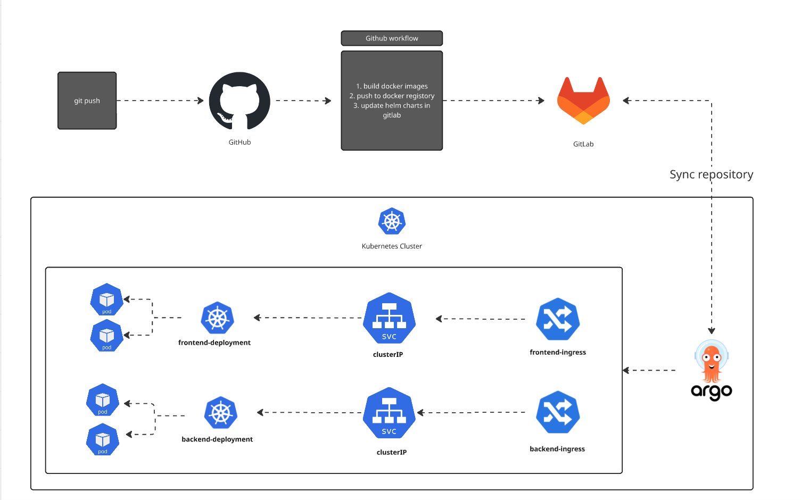

# Chatter Link
Welcome to chatter link - A daynmic and scalable chat application

## Overview
This application demonstrates my practical knowlegde in full stack development and also devOps operations. This application is built to scale. The application doens't run on my local system, instead it runs in a kubernetes cluster that is ready to scale. For my messaging protocalls I'm using websocks to stream line messaging and reduce api calls to the backend for optimization. I also implemented the CI/CD pipeline leaverging argocd so that the code can sync with the kubernetes cluster when I push my code to the repository.

## Tech stack
1. Spring boot for the backend
2. React.JS for the frontend
3. Websockets for dynamic messaging
4. MongoDB for a flexible data store
5. Github action to automatically build the docker image when I push code and update the helm charts in gitlab automatically
6. GitLab for helm charts
7. Finally argocd to moniter the kubernetes helm charts to sync deployment when code is changed

## Chat application

### login page

### Chat page

## Websocket for dynamic messaging

### Kubernetes infrastructure syncing with argocd

## CI/CD pipeline with argocd

